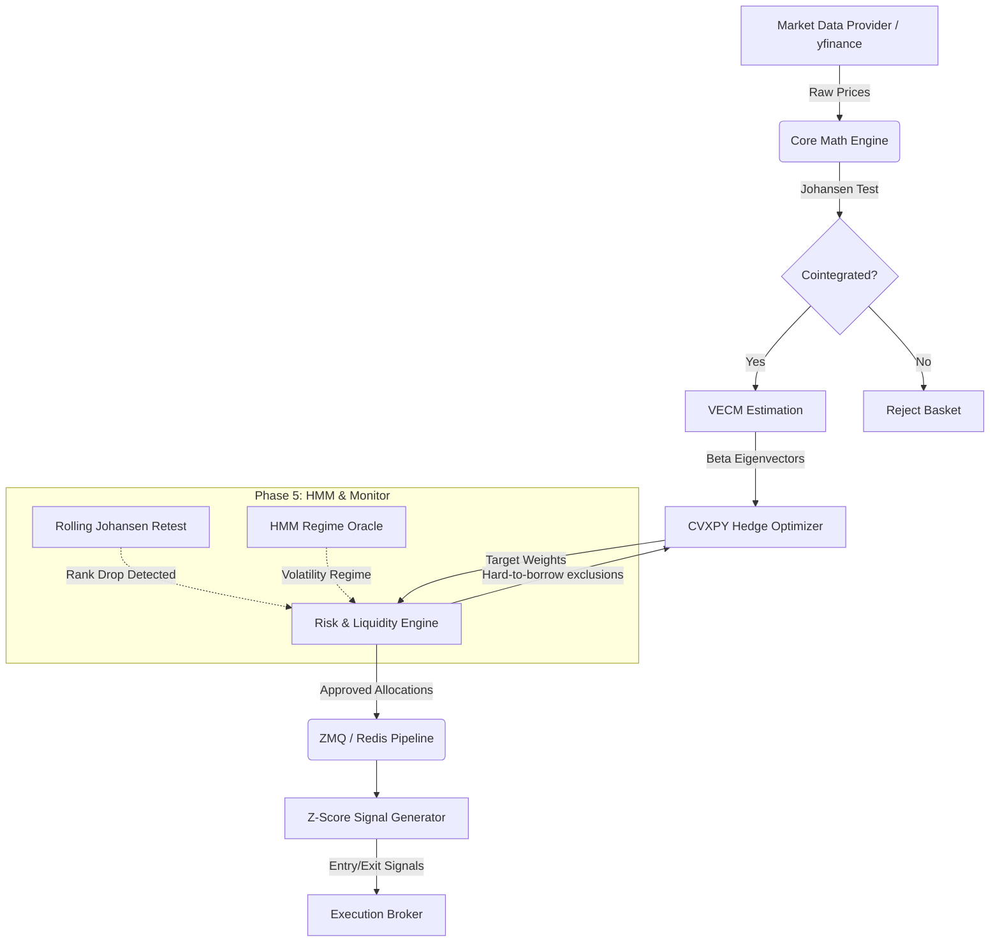

# VECM Arbitrage System 📈

[](https://python.org)
[](https://opensource.org/licenses/MIT)

A production-grade **Vector Error Correction Model (VECM)** statistical arbitrage engine for correlated equity baskets. Designed to programmatically identify, optimize, and trade mean-reverting spreads among cointegrated assets, minimizing market exposure while capturing statistical alpha.

---

## 🧠 Core Methodology

This system departs from simple correlation (which is spurious and non-stationary) by relying on strict **Cointegration**.

1. **Rank Detection**: Uses the **Johansen Cointegration Test** (Trace & Maximum Eigenvalue statistics) to detect the exact number of cointegrating relationships (the rank) within an $N$-asset basket.
2. **Speed of Mean Reversion**: Estimates the **Vector Error Correction Model (VECM)** to compute the error-correction speed matrix ($\alpha$) and extracts the half-life of mean reversion.
3. **Regime Detection**: Utilizes **Hidden Markov Models (HMM)** to detect market regimes, turning off the strategy during structural breaks or extreme volatility regimes.
4. **Constrained Optimization**: Instead of raw eigenvectors, it uses **CVXPY** convex optimization to calculate bounded hedge weights, accounting for gross exposure limits and dynamically excluding halted or hard-to-borrow assets.
5. **Execution Cost Modeling**: Incorporates a **Square-Root Market Impact** model alongside maker/taker fees and annualized borrow costs to simulate real-world slippage.

---

## 🏗 System Architecture

The pipeline is fully decoupled and distributed, enabling live trading latency and robust backtesting.



---

## 📂 Project Structure

```text
vecm/
├── core/             # Mathematical core (Johansen, VECM, HMM, Data Loaders)
├── risk/             # CVXPY Optimizer, Liquidity Monitor, Position Rebalancer
├── pipeline/         # Async pub/sub architecture (ZeroMQ / Redis)
├── backtest/         # Vectorized & Event-driven backtesting, Transaction costs
├── notebooks/        # Jupyter scratchpads for EDA and model tuning
├── config.py         # Global parameters and thresholds
└── drone_solver.py   # Sub-module routing logic
```

---

## 🚀 Quick Start

### 1. Installation

Clone the repository and install the dependencies:

```bash
git clone https://github.com/vikask3906/vecm.git
cd vecm
pip install -r requirements.txt
```

> [!NOTE]
> If using the **Redis** backend for the pipeline (Phase 2), ensure Redis is installed and running locally on port `6379`.

### 2. Phase 1 — Core Math Engine
Test the underlying math on historical data. Fetches data, runs ADF, Johansen, estimates VECM, and computes the spread.
```bash
python run_phase1.py
```

### 3. Phase 2 — Distributed Pipeline
Demonstrates the ZeroMQ pub-sub architecture with historical price replay and live z-score signal generation.
```bash
python run_phase2.py
```

### 4. Phase 3 — Risk Engine
Shows CVXPY hedge optimization in action, simulating liquidity events (e.g., trading halts, hard-to-borrow status) and dynamically rebalancing.
```bash
python run_phase3_demo.py
```

### 5. Full Backtest (Phase 4 + 5)
Executes the comprehensive backtester. Includes transaction fees, borrow costs, market impact slippage, and rolling cointegration breakdown monitoring.
```bash
python run_backtest.py
```

---

## ⚙️ Configuration

All hyperparameters are centralized in `config.py`. Key parameters include:

| Parameter | Default | Description |
|---|---|---|
| `ASSETS` | `["COP", "CVX", "DVN"]` | Target equity basket |
| `ENTRY_ZSCORE` | `2.0` | Z-score threshold to enter a position |
| `EXIT_ZSCORE` | `0.2` | Z-score threshold to exit/take profit |
| `STOP_LOSS_ZSCORE` | `4.0` | Hard stop-loss threshold |
| `ZSCORE_WINDOW` | `60` | Rolling lookback for mean/std (days) |
| `MAKER_FEE_BPS` | `0.5` | Maker fee execution cost |
| `BORROW_COST_ANNUAL_BPS`| `50.0` | Cost to borrow shorted assets |
| `IMPACT_COEFFICIENT` | `0.1` | Slippage scalar for square-root impact |

> [!TIP]
> To modify the strategy's sensitivity, adjust the `ENTRY_ZSCORE` and `ZSCORE_WINDOW` before modifying the underlying Johansen lags (`JOHANSEN_K_AR_DIFF`).

---

## 🧪 Testing

Run the full pytest suite to validate the math, constraints, and architecture:

```bash
python -m pytest tests/ -v
```

---

## 📚 Key Mathematical References

- **Johansen, S. (1991)**: *"Estimation and Hypothesis Testing of Cointegration Vectors in Gaussian Vector Autoregressive Models"* (Econometrica)
- **Engle, R. F., & Granger, C. W. J. (1987)**: *"Co-Integration and Error Correction: Representation, Estimation, and Testing"*
- **Almgren, R., & Chriss, N. (2001)**: *"Optimal Execution of Portfolio Transactions"* (For market impact modeling)

---
> [!WARNING]
> **Disclaimer**: This codebase is provided for research and educational purposes only. Statistical arbitrage strategies carry extreme risk, particularly regarding model breakdown, liquidity dry-ups, and short-squeeze scenarios. Do not run this live without rigorous paper trading and risk limits.
